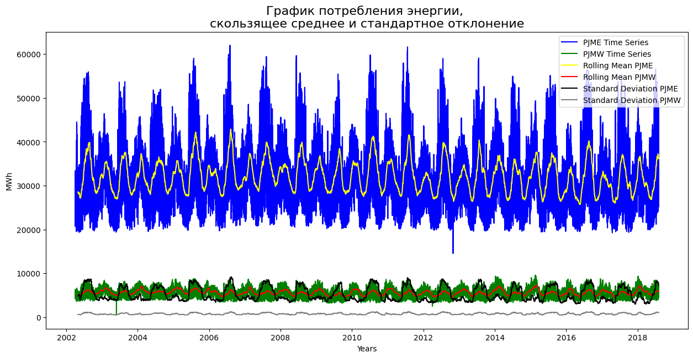
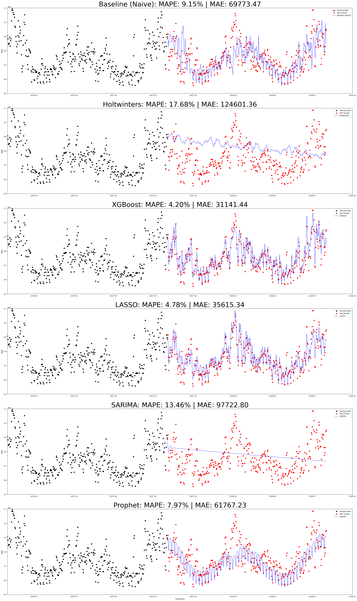

# **ПРОЕКТ 7. ДИПЛОМ. ПРОГНОЗ РАСХОДА ЭНЕРГИИ ПО ВРЕМЕННЫМ РЯДАМ**

 

## 📂 **Содержание**

1. [Краткий обзор](https://github.com/Licharg/SkillFactory/blob/master/Projects/Project_7/README.md#Краткий-обзор)
2. [Библиотеки и модули](https://github.com/Licharg/SkillFactory/blob/master/Projects/Project_7/README.md#Библиотеки-и-модули)
3. [EDA](https://github.com/Licharg/SkillFactory/blob/master/Projects/Project_7/README.md#EDA)
  3.1 [Обработка и очистка данных](https://github.com/Licharg/SkillFactory/blob/master/Projects/Project_7/README.md#Обработка-и-очистка-данных)
  3.2 [Визуализация очищенных исходных данных](https://github.com/Licharg/SkillFactory/blob/master/Projects/Project_7/README.md#Визуализация-очищенных-исходных-данных)
  3.3 [Графический анализ энергопотребления](https://github.com/Licharg/SkillFactory/blob/master/Projects/Project_7/README.md#Графический-анализ-энергопотребления)
  3.4 [Графический анализ энергопотребления с учётом времени года](https://github.com/Licharg/SkillFactory/blob/master/Projects/Project_7/README.md#Графический-анализ-энергопотребления-с-учётом-времени-года)
  3.5 [Анализ на гистограммах по временам года](https://github.com/Licharg/SkillFactory/blob/master/Projects/Project_7/README.md#Анализ-на-гистограммах-по-временам-года)
4. [Статистический анализ данных](https://github.com/Licharg/SkillFactory/blob/master/Projects/Project_7/README.md#Статистический-анализ-данных)
  4.1 [Сезонная декомпозиция](https://github.com/Licharg/SkillFactory/blob/master/Projects/Project_7/README.md#Сезонная-декомпозиция)
  4.2 [Стационарность и гетероскедастичность](https://github.com/Licharg/SkillFactory/blob/master/Projects/Project_7/README.md#Стационарность-и-гетероскедастичность)
  4.3 [Автокорреляция и частичная автокорреляция](https://github.com/Licharg/SkillFactory/blob/master/Projects/Project_7/README.md#Автокорреляция-и-частичная-автокорреляция)
5. [Моделирование временных рядов](https://github.com/Licharg/SkillFactory/blob/master/Projects/Project_7/README.md#Моделирование-временных-рядов)
  5.1 [Подготовка данных к моделированию](https://github.com/Licharg/SkillFactory/blob/master/Projects/Project_7/README.md#Подготовка-данных-к-моделированию)
  5.2 [Модель `Baseline` - наивный прогноз](https://github.com/Licharg/SkillFactory/blob/master/Projects/Project_7/README.md#Модель-`Baseline`---наивный-прогноз-(`AR`))
  5.3 [Модель `HWES` - тройное экспонециальное сглаживание Холта-Винтера](https://github.com/Licharg/SkillFactory/blob/master/Projects/Project_7/README.md#Модель-`HWES`---тройное-экспонециальное-сглаживание-Холта-Винтера)
  5.4 [Модель `XGBoost`](https://github.com/Licharg/SkillFactory/blob/master/Projects/Project_7/README.md#Модель-`XGBoost`)
  5.5 [Модель `Lasso` - `L1`-регрессия](https://github.com/Licharg/SkillFactory/blob/master/Projects/Project_7/README.md#Модель-`LASSO`---`L1`-регрессия)
  5.6 [Модель `SARIMA`](https://github.com/Licharg/SkillFactory/blob/master/Projects/Project_7/README.md#Модель-`SARIMA`)
  5.7 [Модель `Prophet`](https://github.com/Licharg/SkillFactory/blob/master/Projects/Project_7/README.md#Модель-`Prophet`)
6. [Выводы](https://github.com/Licharg/SkillFactory/blob/master/Projects/Project_7/README.md#Выводы)

### 📂 **Краткий обзор**

- В этом проекте используются данные о потреблении энергии с сайта региональной организации США `PJM`. С их помощью можно построить модель временных рядов, чтобы прогнозировать энергетический расход. Кроме того, эти данные пригодятся, чтобы выявить тенденции расходов по времени суток, праздникам и более длительным срокам.
- Данные взяты из соревнования на [Kaggle](https://www.kaggle.com/datasets/robikscube/hourly-energy-consumption).
- `PJM Interconnection LLC (PJM)` - региональная организация передачи данных (`RTO`) в Соединенных Штатах. Это часть сети Восточного межсоединения, управляющая системой передачи электроэнергии, обслуживающей весь или части Делавэра, Иллинойса, Индианы, Кентукки, Мэриленда, Мичигана, Нью-Джерси, Северной Каролины, Огайо, Пенсильвании, Теннесси, Вирджинии, Западной Вирджинии и округа Колумбия.
- Данные о почасовом потреблении энергии берутся с веб-сайта `PJM` и выражаются в мегаваттах (МВт*ч).
- Регионы менялись с годами, поэтому данные могут отображаться только для определенных дат в каждом регионе.

### 📂 **Библиотеки и модули**

  В ноутбуке в основном использованы следующие библиотеки и модули:

- `Numpy`
- `Pandas`
- `Matplotlib`
- `Seaborn`
- `Statsmodels`
- `Sklearn`
- `Xgboost`
- `Prophet`

### 📂 **`EDA`**

#### 📐 **Обработка и очистка данных**

  Читаем данные, выбираем признаки для дальнейшей работы, смотрим статистические данные, определяем и избавляемся от дубликатов и пропусков.

#### 📐 **Визуализация очищенных исходных данных**

  Визуализируем очищенные данные в ежечасовом, ежедневном и еженедельном формате. Делаем предварительные выводы и гипотезы.

#### 📐 **Графический анализ энергопотребления**

  Готовим данные и выполняем визуализацию в разрезе: час, день недели, день месяца, неделя года, месяц, квартал, год.

#### 📐 **Графический анализ энергопотребления с учётом времени года**

  Готовим данные и выполняем визуализацию в разрезе: час, день недели, день месяца, неделя года, месяц, квартал, год, но с учётом времени года (зима, весна, лето, осень).

#### 📐 **Анализ на гистограммах по временам года**

  Готовим данные и выполняем визуализацию на гистограммах в разрезе: времени года. Делаем предварительные выводы и гипотезы по выполненным ранее визуализациям.

### 📂 **Статистический анализ данных**

#### 📐 **Сезонная декомпозиция**

  Раскладываем данные на компоненты:

- Уровень;
- Тенденция;
- Сезонность;
- Шум.

  Визуализируем результаты и делаем предварительные выводы.

#### 📐 **Стационарность и гетероскедастичность**

  Проверяем данные на стационарность (Тест Дики-Фуллера) и гетероскедастичность (гомоскедастичность). Делаем предварительные выводы, предварительно определяем параметры: `d`, `D`.

#### 📐 **Автокорреляция и частичная автокорреляция**

  Строим графики `ACF` и `PACF`. Предварительно определяем параметры: `p`, `q`, `P`, `Q`, `m`. Определяем скользящее среднее значение и стандартное отклонение, визуализируем результаты.

### 📂 **Моделирование временных рядов**

#### 📐 **Подготовка данных к моделированию**

  Определяемся с перечнем моделей, которые будем использовать для моделирования временных рядов. Делим данные на тренировочную и тестовую выборки.

#### 📐 **Модель `Baseline` - наивный прогноз (`AR`)**

  В качествет `Baseline` (наивного прогноза) применяем авторегрессионную модель (`AR`) — т.е. модель временных рядов, которая описывает, как прошлые значения временного ряда влияют на его текущее значение. Таким образом, авторегрессия представляет собой линейную регрессию на себя.

#### 📐 **Модель `HWES` - тройное экспонециальное сглаживание Холта-Винтера**

  Модель прогноза Хольта Винтерса — это 3-х параметрическая модель прогноза, которая учитывает:

- Сглаженный экспоненциальный ряд;
- Тренд;
- Сезонность.

#### 📐 **Модель `XGBoost`**

  `XGBoost` - это оптимизированная распределенная библиотека градиентного бустинга, предназначенная для эффективного и масштабируемого обучения моделей машинного обучения.

#### 📐 **Модель `LASSO` - `L1`-регрессия**

  Регрессия Лассо основана на линейной регрессионной модели, но дополнительно выполняет так называемую `L1` регуляризационную процедуру, представляющую собой процесс введения дополнительной информации с целью предотвращения переобучения.

#### 📐 **Модель `SARIMA`**

  Модель сезонного авторегрессионного скользящего среднего с семью структурными параметрами: (`p`, `d`, `q`)(`P`, `D`,
  `Q`, `m`).

#### 📐 **Модель `Prophet`**

  `Prophet` — это библиотека с открытым исходным кодом от компании `Facebook`. Она предназначена для прогнозирования временных рядов. По словам разработчиков (команды `Core Data Science team`) данный инструмент хорошо работает с рядами, которые имеют ярко выраженные сезонные эффекты, а также имеют несколько таких периодов. Prophet устойчив к отсутствию данных и достаточно хорошо справляется с выбросами.

### 🔍 **Выводы**

  Результаты расчётов представим в виде таблице. Используемые метрики были:

- Средняя абсолютная погрешность (`MAE`)
- Средняя абсолютная процентная ошибка (`MAPE`)
- Среднеквадратичная ошибка (`RMSE`)
- Коэффициент детерминации (`R2`)

|Модель|`MAE`|`RMSE`|`MAPE`|`R2`|
|:---:|:---:|:---:|:---:|:---:|
|`Baseline (AR)`|69773|94868|9.2|0.21|
|`HWES`|124601|144758|17.7|-0.84|
|`XGBoost`|31141|40435|4.2|0.86|
|`LASSO`|35615|43907|4.8|0.83|
|`SARIMA`|96365|118034|13.2|-0.22|
|`Prophet`|61767|83527|8.0|0.39|

Как видим, наиболее оптимальной моделью является `XGBoost`, у модели `LASSO` также хорошие результаты метрики, она на втором месте.

